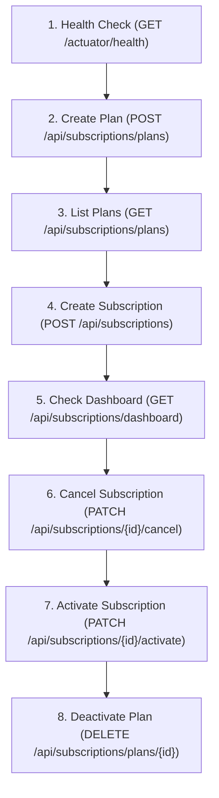

# AgroBackend API Testing Guide (Postman & REST Endpoints)

This guide provides instructions for testing the **AgroBackend** APIs using **Postman** or **cURL**.

> [!NOTE]
> **JWT Security Removed**: All JWT authentication barriers and `@PreAuthorize` role restrictions have been disabled. You do **not** need to send `Authorization: Bearer <token>` headers. All endpoints are open for immediate testing.

---

## 1. Quick Start with Postman

### Step 1: Import the Collection
1. Open **Postman**.
2. Click the **Import** button in the top-left corner.
3. Drag & drop or select the collection file from your project:
   ```
   AgroBackend_Postman_Collection.json
   ```
4. Click **Import**. You will see the collection named **`AgroBackend API (No JWT - Direct Testing)`**.

### Step 2: Collection Variables
The collection is preconfigured with the following variables:
| Variable | Default Value | Description |
| :--- | :--- | :--- |
| `baseUrl` | `http://localhost:8080` | Base server address |
| `planId` | *(Auto-populated)* | Dynamically captured after creating a plan |
| `subscriptionId` | *(Auto-populated)* | Dynamically captured after creating a subscription |

---

## 2. API Endpoints Reference

### A. Subscription Plans (`/api/subscriptions/plans`)

#### 1. Create Subscription Plan
- **Method**: `POST`
- **URL**: `{{baseUrl}}/api/subscriptions/plans`
- **Headers**: `Content-Type: application/json`
- **Request Body**:
```json
{
  "planName": "Kisan Mitra Annual Plan",
  "description": "Comprehensive agricultural advisory, daily mandi prices, soil health reports, and weather alerts.",
  "duration": 12,
  "durationUnit": "MONTH",
  "price": 1499.00,
  "currency": "INR",
  "enabled": true,
  "region": "MAHARASHTRA"
}
```
- **Allowed `durationUnit` values**: `DAY`, `MONTH`, `YEAR`
- **Expected Status**: `201 Created`
- **Sample Response**:
```json
{
  "id": "673f1c8b9a12bc0012345678",
  "planName": "Kisan Mitra Annual Plan",
  "description": "Comprehensive agricultural advisory, daily mandi prices, soil health reports, and weather alerts.",
  "duration": 12,
  "durationUnit": "MONTH",
  "price": 1499.00,
  "currency": "INR",
  "enabled": true,
  "status": "ACTIVE",
  "region": "MAHARASHTRA",
  "createdAt": "2026-09-20T14:20:00Z",
  "updatedAt": "2026-09-20T14:20:00Z",
  "createdBy": "admin",
  "updatedBy": "admin"
}
```

---

#### 2. Get All Subscription Plans
- **Method**: `GET`
- **URL**: `{{baseUrl}}/api/subscriptions/plans`
- **Expected Status**: `200 OK`
- **Sample Response**:
```json
[
  {
    "id": "673f1c8b9a12bc0012345678",
    "planName": "Kisan Mitra Annual Plan",
    "duration": 12,
    "durationUnit": "MONTH",
    "price": 1499.00,
    "currency": "INR",
    "enabled": true,
    "status": "ACTIVE",
    "region": "MAHARASHTRA"
  }
]
```

---

#### 3. Get Subscription Plan By ID
- **Method**: `GET`
- **URL**: `{{baseUrl}}/api/subscriptions/plans/{{planId}}`
- **Expected Status**: `200 OK` (or `404 Not Found` if ID does not exist)

---

#### 4. Update Subscription Plan
- **Method**: `PUT`
- **URL**: `{{baseUrl}}/api/subscriptions/plans/{{planId}}`
- **Headers**: `Content-Type: application/json`
- **Request Body**:
```json
{
  "planName": "Kisan Mitra Annual Plan (Discounted)",
  "description": "Updated advisory plan with 24x7 agronomist phone support.",
  "duration": 12,
  "durationUnit": "MONTH",
  "price": 1299.00,
  "region": "MAHARASHTRA"
}
```
- **Expected Status**: `200 OK`

---

#### 5. Toggle Plan Status (Enable/Disable)
- **Method**: `PATCH`
- **URL**: `{{baseUrl}}/api/subscriptions/plans/{{planId}}/status?enabled=false`
- **Query Parameter**: `enabled` (`true` or `false`)
- **Expected Status**: `200 OK`

---

#### 6. Deactivate Plan (Soft Delete)
- **Method**: `DELETE`
- **URL**: `{{baseUrl}}/api/subscriptions/plans/{{planId}}`
- **Expected Status**: `200 OK`
- **Behavior**: Marks `enabled: false` and `status: "INACTIVE"`.

---

### B. Subscriptions (`/api/subscriptions`)

#### 1. Create Subscription
- **Method**: `POST`
- **URL**: `{{baseUrl}}/api/subscriptions`
- **Headers**: `Content-Type: application/json`
- **Request Body**:
```json
{
  "subscriberId": "farmer_1001",
  "subscriberName": "Suresh Kumar Patil",
  "subscriberType": "CUSTOMER",
  "planId": "{{planId}}"
}
```
- **Allowed `subscriberType` values**: `CUSTOMER`, `VENDOR`
- **Expected Status**: `201 Created`
- **Sample Response**:
```json
{
  "id": "673f1d5e9a12bc0012345679",
  "subscriberId": "farmer_1001",
  "subscriberName": "Suresh Kumar Patil",
  "subscriberType": "CUSTOMER",
  "planId": "673f1c8b9a12bc0012345678",
  "planName": "Kisan Mitra Annual Plan",
  "startDate": "2026-09-20T14:22:00Z",
  "endDate": "2027-09-20T14:22:00Z",
  "status": "ACTIVE",
  "amount": 1499.00,
  "currency": "INR",
  "createdAt": "2026-09-20T14:22:00Z",
  "updatedAt": "2026-09-20T14:22:00Z"
}
```

---

#### 2. Get All Subscriptions
- **Method**: `GET`
- **URL**: `{{baseUrl}}/api/subscriptions`
- **Expected Status**: `200 OK`

---

#### 3. Get Subscription By ID
- **Method**: `GET`
- **URL**: `{{baseUrl}}/api/subscriptions/{{subscriptionId}}`
- **Expected Status**: `200 OK`

---

#### 4. Cancel Subscription
- **Method**: `PATCH`
- **URL**: `{{baseUrl}}/api/subscriptions/{{subscriptionId}}/cancel`
- **Expected Status**: `200 OK`
- **Sample Response**:
```json
{
  "id": "673f1d5e9a12bc0012345679",
  "status": "CANCELLED",
  "cancelledAt": "2026-09-20T14:25:00Z"
}
```

---

#### 5. Activate Subscription
- **Method**: `PATCH`
- **URL**: `{{baseUrl}}/api/subscriptions/{{subscriptionId}}/activate`
- **Expected Status**: `200 OK`
- **Sample Response**:
```json
{
  "id": "673f1d5e9a12bc0012345679",
  "subscriberId": "farmer_001",
  "planId": "673f1d4a9a12bc0012345678",
  "planName": "Kisan Mitra 2026",
  "status": "ACTIVE",
  "startDate": "2026-09-20T14:30:00Z",
  "endDate": "2027-09-20T14:30:00Z",
  "cancelledAt": null
}
```

---

### C. Dashboard & Monitoring

#### 1. Get Dashboard Metrics
- **Method**: `GET`
- **URL**: `{{baseUrl}}/api/subscriptions/dashboard`
- **Expected Status**: `200 OK`
- **Sample Response**:
```json
{
  "totalPlans": 1,
  "totalSubscriptions": 1,
  "activeSubscribers": 1,
  "inactiveSubscribers": 0,
  "totalRevenue": 1499.00,
  "currency": "INR"
}
```

---

#### 2. System Health & Docs
| Endpoint | Method | Purpose |
| :--- | :--- | :--- |
| `/actuator/health` | `GET` | Health status (`{"status":"UP"}`) |
| `/actuator/info` | `GET` | Application metadata |
| `/v3/api-docs` | `GET` | OpenAPI 3.0 specification JSON |
| `/swagger-ui.html` | Browser | Interactive Swagger UI API playground |

---

## 3. Recommended Step-by-Step Testing Flow

Follow this sequence to test end-to-end functionality:



1. **Check Backend Status**: Call `GET http://localhost:8080/actuator/health` to ensure service is `UP`.
2. **Create a Plan**: Run `POST /api/subscriptions/plans`. Postman will automatically capture `planId`.
3. **View All Plans**: Run `GET /api/subscriptions/plans` to verify the plan is listed.
4. **Subscribe a User**: Run `POST /api/subscriptions` using the created `planId`. Postman captures `subscriptionId`.
5. **View Dashboard**: Run `GET /api/subscriptions/dashboard` and verify `activeSubscribers` and `totalRevenue` increased.
6. **Cancel Subscription**: Run `PATCH /api/subscriptions/{{subscriptionId}}/cancel` and check `status` changes to `CANCELLED`.
7. **Activate Subscription**: Run `PATCH /api/subscriptions/{{subscriptionId}}/activate` and check `status` changes back to `ACTIVE`.
8. **Deactivate Plan**: Run `DELETE /api/subscriptions/plans/{{planId}}` and check `status` changes to `INACTIVE`.

---

## 4. cURL Commands for Quick Terminal Testing

If you prefer testing directly in the terminal without Postman:

### 1. Create a Plan
```bash
curl -X POST http://localhost:8080/api/subscriptions/plans \
  -H "Content-Type: application/json" \
  -d "{\"planName\":\"Kisan Mitra 2026\",\"description\":\"Annual farming support\",\"duration\":12,\"durationUnit\":\"MONTH\",\"price\":1499.00,\"currency\":\"INR\",\"enabled\":true,\"region\":\"MAHARASHTRA\"}"
```

### 2. List All Plans
```bash
curl -X GET http://localhost:8080/api/subscriptions/plans
```

### 3. Create Subscription
```bash
curl -X POST http://localhost:8080/api/subscriptions \
  -H "Content-Type: application/json" \
  -d "{\"subscriberId\":\"farmer_001\",\"subscriberName\":\"Ramesh\",\"subscriberType\":\"CUSTOMER\",\"planId\":\"<REPLACE_WITH_PLAN_ID>\"}"
```

### 4. Cancel Subscription
```bash
curl -X PATCH http://localhost:8080/api/subscriptions/<REPLACE_WITH_SUBSCRIPTION_ID>/cancel
```

### 5. Activate Subscription
```bash
curl -X PATCH http://localhost:8080/api/subscriptions/<REPLACE_WITH_SUBSCRIPTION_ID>/activate
```

### 6. Fetch Dashboard
```bash
curl -X GET http://localhost:8080/api/subscriptions/dashboard
```

---

## 5. Common Error Responses & Troubleshooting

| Status Code | Reason | Resolution |
| :--- | :--- | :--- |
| `400 Bad Request` | `Plan name is required` or `Plan is not active` | Provide a non-empty `planName` or activate the plan before subscribing. |
| `404 Not Found` | `Plan not found` or `Subscription not found` | Verify that the provided `id` exists in the database. |
| `409 Conflict` | `Plan already exists in this region` | Change the `planName` or `region` (the pair must be unique). |
| `409 Conflict` | `Subscriber already has an active subscription` | Cancel the existing subscription first or use a different `subscriberId`. |
